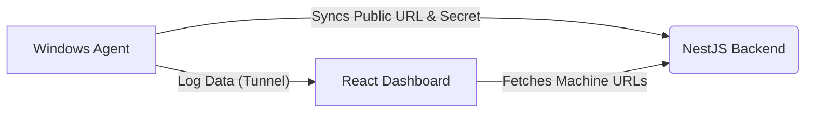

# Log Viewer Agent & Dashboard

A self-hosted, open-source solution to view local log files from any number of remote Windows machines securely through a beautiful web dashboard.

## The "Why"
If you are an IT admin, DevOps engineer, or support tech, you likely know the pain of fighting users for mouse control over AnyDesk, TeamViewer, or RDP *just* to open a `.log` file in notepad. 

This project solves that headache entirely. You install a lightweight, background Windows service on the target machine. That service securely exposes the log files you configure via an API and automatically tunnels itself to your central dashboard. 

You get instant, live-searchable access to remote logs without ever interrupting the user.

## Architecture

The system consists of three main components:
1. **The Windows Agent**: A FastAPI Python service running via NSSM that safely reads local files.
2. **The Backend**: A NestJS server that manages users, authenticates API requests, and catalogs connected machines.
3. **The Dashboard**: A modern React application to view and filter the logs.

## Tunnels (Ngrok vs. Cloudflare)
To expose the local Windows Agent to your central dashboard, a tunneling service is required if the machine is behind a NAT or firewall. 

- **Ngrok (Included):** The automated `install.bat` script has built-in support for downloading and configuring Ngrok as a background service. It will automatically sync its dynamic URL to the dashboard.
- **Cloudflare Tunnels:** If you have your own domain, using Cloudflare Tunnels is highly recommended as a free, permanent alternative to Ngrok. You can easily modify the agent to report your fixed Cloudflare URL to the dashboard.

## Quick Start

### 1. Deploy the Central Server (Backend & Dashboard)
You can deploy the NestJS backend and React dashboard to any standard hosting provider (Vercel, Railway, Render, etc.) or self-host it using Docker.
1. Copy `.env.example` to `.env` in `apps/dashboard` and point `VITE_API_BASE_URL` to your backend.
2. Set your SQLite or PostgreSQL database credentials in the `apps/nest-backend`.
3. Build and run both applications.

### 2. Install the Windows Agent
On the target machine you wish to monitor:
1. Clone or download the `apps/agent` folder.
2. Run `install.bat` as an Administrator.
3. Follow the interactive prompts to define the log directory, patterns, and your Ngrok Authtoken.
4. The script will automatically install the Python dependencies, create the Windows Services, and start syncing!

> **Local Testing:** If you are testing locally without running `install.bat`, you will need to manually populate `apps/agent/config.json` with your parameters (the repo template contains `null` values by default).

## Security Warning
> [!CAUTION]
> **Data Privacy:** Log files often contain highly sensitive user data, PII, or internal system paths.
> 1. **Always use HTTPS:** Never expose the agent or backend over plain HTTP over the internet. Use Ngrok, Cloudflare, or an HTTPS reverse proxy.
> 2. **Protect the Agent Secret:** The agent relies on the `agent_secret` UUID to authenticate incoming requests. Do not share this key.
