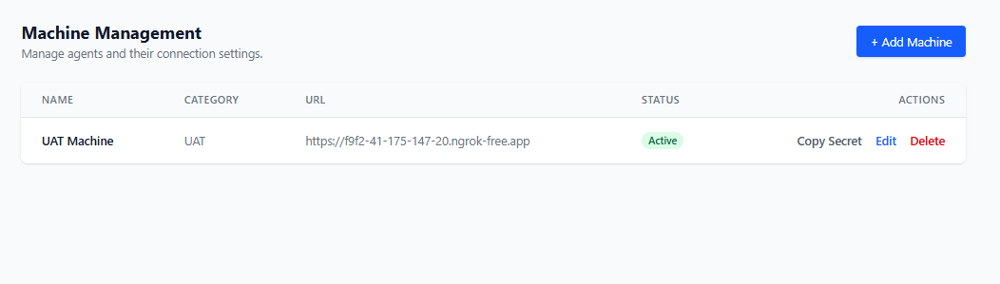
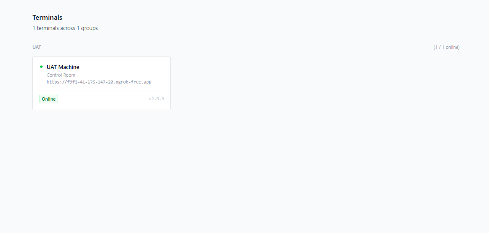

# Dashboard Overview

The Log Viewer Agent dashboard is a beautiful, dark-mode focused React application built with Tailwind CSS.

## Core Features
- **Centralized View:** See all connected machines across different groups (e.g., Development, Staging, Production).
- **Log Streaming:** Read logs directly from remote machines.
- **Role-Based Access Control:** Protects sensitive data using JSON Web Tokens (JWT). Admins can manage machine configurations directly from the web interface.

